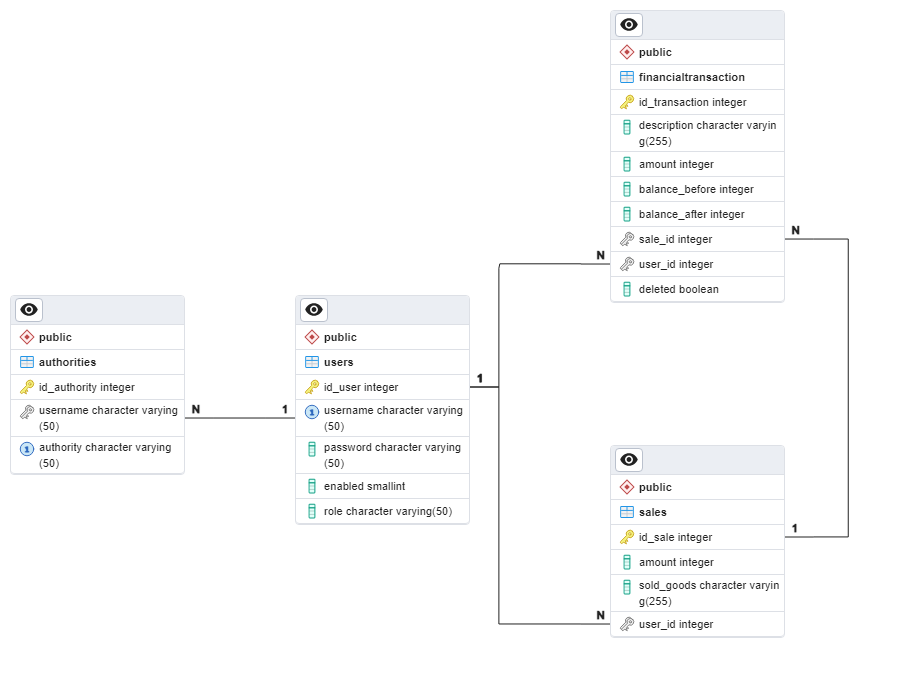

# Informační systém pokladny - Spring boot webová aplikace

Webová aplikace představuje informační systém pokladny.

- **Backend**
Spring Boot

- **Frontend**
Thymeleaf, Bootstrap, JavaScript

Jsou zde dva druhy uživatelů (zaměstnanec, admin).
Liší se v tom, které metody mohou používat.
Zaměstnanec může používat pouze metody pro zaměstnance.
Admin může používat metody pro zaměstnance a pro admina.

V programu je systém přihlašování, kde uživatel zadá jeho jméno a heslo.
Pro testování programu je vytvořen 1 uživatel a 1 admin.

Přihlašovací údaje testovacích účtů:
- **Zaměstnanec**
Jméno: Pokladni
Heslo: a

- **Admin**
Jméno: Admin
Heslo: b

Pro datábazi jsem použil PostgreSQL.

## Struktura databáze

### Tabulka `users`

| Sloupec    | Datový typ        | Popis                                           |
|------------|-------------------|-------------------------------------------------|
| id_user    | SERIAL PRIMARY KEY| Jednoznačný identifikátor uživatele            |
| username   | VARCHAR(50)       | Uživatelské jméno                               |
| password   | VARCHAR(50)       | Heslo uživatele                                 |
| enabled    | SMALLINT          | Indikátor povolení účtu (1 - povolen, 0 - zakázán) |
| role       | VARCHAR(50)       | Role uživatele (výchozí hodnota: 'EMPLOYEE')    |

### Tabulka `authorities`

| Sloupec      | Datový typ        | Popis                                            |
|--------------|-------------------|--------------------------------------------------|
| id_authority | SERIAL PRIMARY KEY| Jednoznačný identifikátor oprávnění             |
| username     | VARCHAR(50)       | Uživatelské jméno                               |
| authority    | VARCHAR(50)       | Oprávnění uživatele                              |

### Tabulka `sales`

| Sloupec   | Datový typ        | Popis                                           |
|-----------|-------------------|-------------------------------------------------|
| id_sale   | SERIAL PRIMARY KEY| Jednoznačný identifikátor prodeje              |
| amount    | INTEGER           | Množství prodaného zboží                        |
| sold_goods| VARCHAR(255)      | Prodávané zboží                                 |
| user_id   | INTEGER           | Identifikátor uživatele provádějícího prodej   |

### Tabulka `financialtransaction`

| Sloupec        | Datový typ        | Popis                                           |
|----------------|-------------------|-------------------------------------------------|
| id_transaction | SERIAL PRIMARY KEY| Jednoznačný identifikátor transakce             |
| description    | VARCHAR(255)      | Popis transakce                                 |
| amount         | INTEGER           | Částka transakce                                |
| balance_before | INTEGER           | Zůstatek před transakcí                         |
| balance_after  | INTEGER           | Zůstatek po transakci                           |
| sale_id        | INTEGER           | Identifikátor prodeje spojeného s transakcí     |
| user_id        | INTEGER           | Identifikátor uživatele spojeného s transakcí   |
| deleted        | BOOLEAN DEFAULT false | Indikátor smazání transakce (true - smazáno, false - ne) |


Při mazání záznamu v tabulce `financialtransaction` neproběhne odstranění záznamu, ale vytvoří nový záznam, který původní transakci vyruší. 
Je to z důvodu archivace dat a zpětné dohledatelnosti (například pro účetnictví).

## Grafické znázornění závislostí v databázi




## Instalace

### Nastavení databáze PostgreSQL
1. Vytvořit databázi - skript pro vytvoření database/create/createDatabase.sql
2. Vytvořit tabulky v databázi - skript pro vytvoření database/create/createTables.sql
3. (Nepovinné) import ukázkových dat (mají zaporné indexy) - database/data
   (Import v pořadí: 1. usersExport - tabulka users 2. authoritiesExport - tabulka authorities 3. salesExport - tabulka sales 4. transactionExport - tabulka financialtransaction)
4. Napojení na databazi v projektu - src/main/resources/application.properties
   
### Přednastavené napojení na databázi
  ```properties
      spring.datasource.url=jdbc:postgresql://localhost:5432/pokladnaSpring
      spring.datasource.username=postgres
      spring.datasource.password=root
  ```

### Konfigurace projektu
nachazí se v src/main/resources/application.properties

## Použití

## Metody pro zaměstnance
- **Zobrazení přehledu pokladny s grafem a výpisem posledních tržeb**
- **Přidání nové tržby v pokladně**
- **Výpis provedených tržeb.**
- **Výpis informací o určité tržbě**
- **Výpis provedených transakcí.**
- **Výpis informací o určité transakci**
- **Zobrazení aktuálního stavu pokladny**

## Metody pro administrátora
- **Odstranění určité existující tržby**
- **Odstranění všech tržeb**
- **Vložení peněz do pokladny**
- **Výběr peněz z pokladny**
- **Odstranění určité existující transakce**
- **Odstranění všech transakcí**
- **Výpis všech uživatelů**
- **Výpis informací o určitém uživateli**
- **Úprava informací o určitém uživateli**
- **Odstranění určitého existujícího uživatele**
- **Odstranění všech uživatelů**


## Autor

Zbyněk Pavlík

